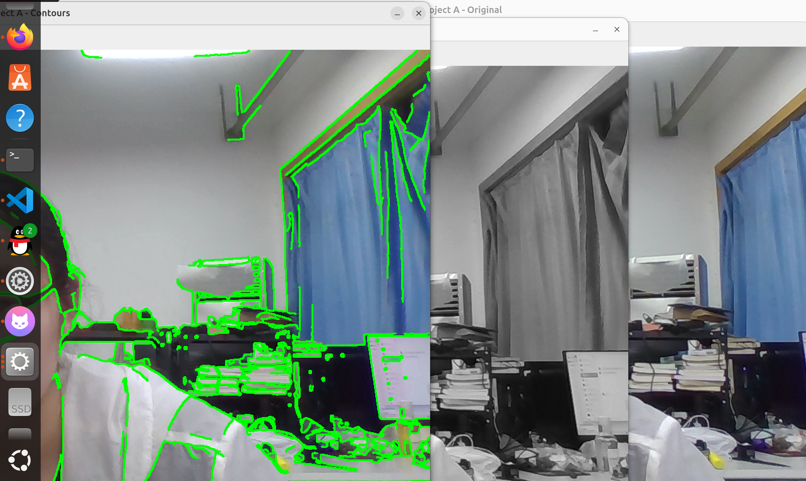
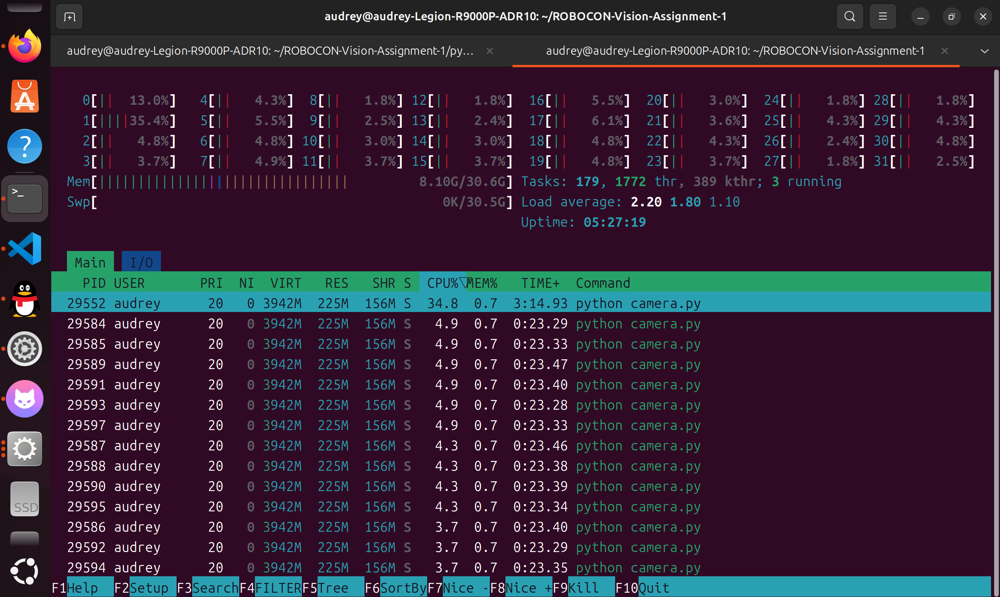

# Assignment 1

ROBOCON 视觉组 Assignment 2 作业仓库。

测试平台：Lenovo Legion R9000P（AMD Ryzen 9 8945HX + NVIDIA GeForce RTX 5060 Laptop GPU + AMD Radeon 集成显卡），Ubuntu 24.04.4 LTS。

---

## 1. System Information

### 1.1 环境信息汇总

| 项目 | 值 |
| --- | --- |
| Ubuntu 版本 | Ubuntu 24.04.4 LTS (Noble Numbat) |
| Kernel 版本 | 7.0.0-30-generic |
| CPU | AMD Ryzen 9 8945HX with Radeon Graphics，16 核 / 32 线程，最高 5462.71 MHz |
| GPU | NVIDIA GeForce RTX 5060 Laptop GPU（独显，`[10de:2d59]`，8151 MiB 显存）<br>AMD/ATI Raphael（集成显卡，`[1002:164e]`） |
| GPU 正在使用的内核驱动 | NVIDIA → `nvidia`；AMD 集成显卡 → `amdgpu` |
| 图形会话类型 | **X11** |
| NVIDIA Driver | 595.84 |
| CUDA Toolkit | **未安装（N/A）** |

### 1.2 Ubuntu 版本

```bash
cat /etc/os-release
```

```text
PRETTY_NAME="Ubuntu 24.04.4 LTS"
NAME="Ubuntu"
VERSION_ID="24.04"
VERSION="24.04.4 LTS (Noble Numbat)"
VERSION_CODENAME=noble
```

### 1.3 Kernel 版本

```bash
uname -r
```

```text
7.0.0-30-generic
```

### 1.4 CPU

```bash
lscpu
```

```text
架构：                     x86_64
CPU:                       32
厂商 ID：                  AuthenticAMD
  型号名称：               AMD Ryzen 9 8945HX with Radeon Graphics
    CPU 系列：             25
    型号：                 97
    每个核的线程数：       2
    每个座的核数：         16
    座：                   1
    CPU 最大 MHz：         5462.7109
    CPU 最小 MHz：         427.8030
Virtualization features:
  虚拟化：                 AMD-V
Caches (sum of all):
  L1d:                     512 KiB (16 instances)
  L2:                      16 MiB (16 instances)
  L3:                      64 MiB (2 instances)
```

> 完整输出还包含 `标记`（指令集标志位）与 `Vulnerabilities` 两段长内容，为保持可读性此处从略。物理核数 = 16 × 1 = 16，逻辑核数 = 16 × 2 = 32。

### 1.5 GPU

```bash
lspci | grep -Ei 'vga|3d|display'
```

```text
01:00.0 VGA compatible controller: NVIDIA Corporation Device 2d59 (rev a1)
05:00.0 VGA compatible controller: Advanced Micro Devices, Inc. [AMD/ATI] Raphael (rev d8)
```

```bash
lspci -nn | grep -Ei 'vga|3d|display'
```

```text
01:00.0 VGA compatible controller [0300]: NVIDIA Corporation Device [10de:2d59] (rev a1)
05:00.0 VGA compatible controller [0300]: Advanced Micro Devices, Inc. [AMD/ATI] Raphael [1002:164e] (rev d8)
```

`lspci` 只认出 NVIDIA 卡的 PCI 设备号 `2d59`，未给出型号，需用 `nvidia-smi` 确认（见 1.8）。

### 1.6 GPU 正在使用的内核驱动

```bash
lspci -k | grep -EA3 'VGA|3D|Display'
```

```text
01:00.0 VGA compatible controller: NVIDIA Corporation Device 2d59 (rev a1)
	Subsystem: Lenovo Device 3e29
	Kernel driver in use: nvidia
	Kernel modules: nvidiafb, nouveau, nvidia_drm, nvidia
--
05:00.0 VGA compatible controller: Advanced Micro Devices, Inc. [AMD/ATI] Raphael (rev d8)
	Subsystem: Lenovo Raphael
	Kernel driver in use: amdgpu
	Kernel modules: amdgpu
```

NVIDIA 卡实际加载的是专有驱动 `nvidia`（`nouveau` 仅出现在候选模块列表中，未被启用）；AMD 集成显卡加载内核自带的 `amdgpu`。

### 1.7 图形会话类型

```bash
echo "$XDG_SESSION_TYPE"
echo "$DISPLAY"
echo "$WAYLAND_DISPLAY"
```

```text
x11
:1

```

当前为 **X11 会话**：`XDG_SESSION_TYPE` 给出类型，`DISPLAY` 为 `:1` 说明存在 X 服务器，`WAYLAND_DISPLAY` 为空说明没有 Wayland compositor 在运行。

### 1.8 NVIDIA Driver

```bash
nvidia-smi
```

```text
+-----------------------------------------------------------------------------------------+
| NVIDIA-SMI 595.84                 Driver Version: 595.84         CUDA Version: 13.2     |
+-----------------------------------------+------------------------+----------------------+
| GPU  Name                 Persistence-M | Bus-Id          Disp.A | Volatile Uncorr. ECC |
| Fan  Temp   Perf          Pwr:Usage/Cap |         Memory-Usage | GPU-Util  Compute M. |
|=========================================+========================+======================|
|   0  NVIDIA GeForce RTX 5060 ...    Off |   00000000:01:00.0 Off |                  N/A |
| N/A   40C    P4              8W /   50W |      15MiB /   8151MiB |      9%      Default |
+-----------------------------------------+------------------------+----------------------+
```

NVIDIA Driver 版本为 **595.84**。上表默认输出会截断较长的卡名，改用 `--query-gpu` 取完整信息：

```bash
nvidia-smi --query-gpu=name,driver_version,memory.total --format=csv
```

```text
name, driver_version, memory.total [MiB]
NVIDIA GeForce RTX 5060 Laptop GPU, 595.84, 8151 MiB
```

### 1.9 CUDA Toolkit

```bash
nvcc --version
```

```text
找不到命令 “nvcc”，但可以通过以下软件包安装它：
sudo apt install nvidia-cuda-toolkit
```

**本机未安装 CUDA Toolkit。** 本作业的 C++ 部分只需 OpenCV 与 Eigen，不需要 CUDA，因此无需安装。

### 1.10 关于 CUDA 版本的重要区分

`nvidia-smi` 输出中的 `CUDA Version: 13.2` **不能**理解为「本机安装了 CUDA 13.2 Toolkit」，二者含义不同：

| | 含义 | 本机情况 |
| --- | --- | --- |
| `nvidia-smi` 中的 `CUDA Version` | 该 **NVIDIA 驱动所支持的最高 CUDA 运行时版本**，是驱动能力的上限，随驱动一起提供 | 13.2 |
| CUDA Toolkit | **实际安装的开发工具链**（含 `nvcc` 编译器、头文件、运行时库），需单独安装 | **未安装（N/A）** |

即：本机驱动有能力运行面向 CUDA 13.2 及以下版本构建的程序，但因未安装 Toolkit，**无法在本机编译** CUDA 代码——`nvcc` 命令不存在即为直接证据。

---

## 2. Python Project A

Project A 代码位于 `python_A/`，功能为：打开摄像头 → 持续读取图像 → 显示原始图像 → 灰度化 → 轮廓提取 → 持续运行 → `q` / `ESC` 退出 → 保存未经处理的原始摄像头视频。

### 2.1 环境创建与激活

项目 `pyproject.toml` 声明 `requires-python = ">=3.9,<3.11"`，因此选择 Python 3.10。**未修改 `pyproject.toml` 中的任何约束。**

```bash
conda create -n robocon-a python=3.10 -y
conda activate robocon-a
```

```text
Preparing transaction: done
Verifying transaction: done
Executing transaction: done

To activate this environment, use
    $ conda activate robocon-a
```

### 2.2 解释器确认

```bash
python --version
which python
```

```text
Python 3.10.21
/home/audrey/miniconda3/envs/robocon-a/bin/python
```

`which python` 指向 `envs/robocon-a/bin/python`，确认解释器来自新建的 Conda 环境，而不是 `base`。

### 2.3 依赖安装

```bash
cd ~/ROBOCON-Vision-Assignment-1/python_A
python -m pip install -e . -i https://pypi.tuna.tsinghua.edu.cn/simple
```

> 命令末尾的 `-i` 指定了清华 PyPI 镜像以加快下载；`. ` 表示安装当前目录的项目，`-e` 为可编辑安装。加上 `.` 之后 pip 会读取 `pyproject.toml` 并强制执行其中声明的 `requires-python` 与依赖版本范围。

```text
Obtaining file:///home/audrey/ROBOCON-Vision-Assignment-1/python_A
Collecting numpy<2.0,>=1.26 (from robocon-vision-assignment1-project-a==1.0.0)
Collecting opencv-python<5.0,>=4.9 (from robocon-vision-assignment1-project-a==1.0.0)
Successfully installed numpy-1.26.4 opencv-python-4.11.0.86 robocon-vision-assignment1-project-a-1.0.0
```

安装过程中 pip 依次尝试了 opencv-python 的 4.14.0.94、4.13.0.92、4.13.0.90、4.12.0.88 四个版本，最终回退到 **4.11.0.86**。原因是 OpenCV 4.12 及以上要求 `numpy>=2`，与项目声明的 `numpy>=1.26,<2.0` 冲突。这说明 pip 确实在读取并服从 `pyproject.toml` 的约束，而不是绕过它。

验证安装结果：

```bash
python -c "import cv2, numpy; print(cv2.__version__, numpy.__version__)"
```

```text
4.11.0 1.26.4
```

### 2.4 运行

```bash
python camera.py
```

```text
================================================================
ROBOCON Vision Assignment 1 - Python Project A
PID:          32421
PPID:         9628
Python:       /home/audrey/miniconda3/envs/robocon-a/bin/python
Python ver.:  3.10.21
Camera index: 0
Raw output:   /home/audrey/ROBOCON-Vision-Assignment-1/python_A/raw_capture.mp4
Keep this process running and inspect it from another terminal.
Press q or ESC in an OpenCV window to exit.
================================================================
Actual stream: 1280x720, writer FPS=10.00
Saved raw video: /home/audrey/ROBOCON-Vision-Assignment-1/python_A/raw_capture.mp4
Captured frames: 460
Elapsed time:    47.4 s
Loop rate:       9.7 frame/s
```

程序连续运行 **47.4 秒**（要求 ≥30 秒），按 `q` 退出。

### 2.5 输出视频

```bash
ls -lh raw_capture.mp4
```

```text
-rw-rw-r-- 1 audrey audrey 13M  9月 26 17:50 raw_capture.mp4
```

输出为**未经任何处理的原始摄像头视频**：代码中 `writer.write(frame)` 在 `process_frame()` 之前执行，写入的是 `capture.read()` 拿到的原始帧。

### 2.6 图像结果截图



三个窗口（Original / Grayscale / Contours）同时来自正在运行的 Project A。

---

## 3. Process Observation

Project A 在启动时会打印自己的 PID。本节的做法是：让程序在**终端 1** 中持续运行，另开**终端 2**，完全从系统层面独立找出这个进程，再与程序自己打印的 PID 核对。

> 本节观察的是**独立的一次运行**：为了让进程有足够时间被观察（期间还要打开 `htop`、截图），该次运行持续了约 11 分钟。因此本节出现的 PID 与 2.4 节记录的那次运行不同，属于正常现象。

### 3.1 查找过程

**第一步：用 `pgrep` 按完整命令行匹配**

```bash
pgrep -af "python camera.py"
```

```text
29552 python camera.py
```

`-f` 让 pgrep 匹配**完整命令行**而非仅匹配进程名。这一步是必需的：该进程的进程名实际是 `python`，若不加 `-f` 而直接搜 `camera.py`，不会有任何结果。`-a` 顺带把命令行打印出来，便于核对。

> 匹配串写成 `"python camera.py"` 而不是裸的 `"camera.py"`，是因为 `-f` 做的是纯文本匹配，任何命令行中碰巧含有该字符串的进程都会被命中——实测中 `pgrep -af "camera.py"` 会把执行该命令的 shell 自身也匹配出来。

**第二步：用 `ps` 一次取出全部所需字段**

```bash
ps -o pid,ppid,cmd,%cpu,%mem,etime -p $(pgrep -f "python camera.py")
```

```text
    PID    PPID CMD                         %CPU %MEM     ELAPSED
  29552    9628 python camera.py             139  0.7       05:59
```

`$(...)` 是命令替换：先执行内层 `pgrep` 得到 PID，再把结果填入 `ps` 的 `-p` 参数位置。`-o` 指定输出列：

| 列 | 含义 | 实测值 |
| --- | --- | --- |
| `pid` | PID | **29552** |
| `ppid` | PPID（父进程 PID） | **9628** |
| `cmd` | CMD（完整命令行） | **python camera.py** |
| `%cpu` | CPU 占用百分比 | **139** |
| `%mem` | 物理内存占用百分比 | **0.7** |
| `etime` | 已运行时间（elapsed time） | **05:59** |

**第三步：用 `pstree` 查看该进程下的线程**

```bash
pstree -p $(pgrep -f "python camera.py")
```

```text
python(29552)─┬─{python}(29553)
              ├─{python}(29554)
              ├─{python}(29555)
              ├─{python}(29556)
              │      ...
              ├─{python}(29614)
              └─{python}(29615)
```

`-p` 显示各节点的 PID，花括号 `{}` 包裹的就是线程。该进程共 **63 个线程**，线程 PID 从 29553 连续排到 29615。

### 3.2 PID 核对

| 来源 | PID |
| --- | --- |
| 程序自己打印（终端 1） | 29552 |
| 从系统中查出（终端 2 的 `pgrep`） | 29552 |

**两者一致。**

### 3.3 htop 截图



截图前的操作：按 `F4` 输入 `camera.py` 过滤出目标进程，再按 `H` 打开线程显示。

图中可确认两项内容：

- **整机使用情况**：32 个逻辑核各自的占用条、内存 `8.10G/30.6G`、`Tasks: 179, 1772 thr`、`Load average: 2.20 1.80 1.10`、`Uptime: 05:27:19`。
- **该进程占用的线程**：主进程 `PID 29552`（`TIME+` 为 `3:14.93`），其下 63 个线程缩进排列，每个线程单独列出 `CPU%` 与 `TIME+`（约 `0:23`）。

### 3.4 CPU 139% 与 63 个线程的来源

`ps` 报告的 `%CPU` 为 139%，**超过 100%**。这是因为该列是跨所有核心的累计值：本机有 32 个逻辑核，单线程任务满负荷也只有 100%，139% 说明该进程同时在多个核心上运行。

线程数 63 则来自 OpenCV 与 Qt：

```bash
python -c "import cv2; print(cv2.getNumThreads())"
```

```text
32
```

```bash
python -c "import cv2; print(cv2.getBuildInformation())" | grep -E 'GUI|Parallel'
```

```text
  GUI:                           QT5
  Parallel framework:            pthreads
```

OpenCV 使用 pthreads 作为并行后端，默认按 CPU 数量（32）创建工作线程池；Qt5 GUI 后端又为三个 `cv2.imshow` 窗口另开事件线程——两者相加即 `pstree` 中看到的 63 个线程，也是该进程 CPU 时间的主要来源。

---

## 4. Python Project B

Project B 位于 `python_B/`，读取 Project A 保存的原始 MP4，进行离线处理并输出另一个 MP4。输出为三个并排面板：

```text
原始视频 | Canny 边缘 | 帧间运动区域
```

该项目**刻意不使用 OpenCV**，依赖 ImageIO、FFmpeg、NumPy 与 scikit-image。

### 4.1 环境创建与激活

```bash
conda create -n robocon-b python=3.12 -y
conda activate robocon-b
```

`VERSION_REQUIREMENTS.md` 推荐 3.12 或 3.13，此处选择 3.12。

### 4.2 解释器确认

```bash
python --version
which python
```

```text
Python 3.12.14
/home/audrey/miniconda3/envs/robocon-b/bin/python
```

### 4.3 依赖安装

```bash
cd ~/ROBOCON-Vision-Assignment-1/python_B
python -m pip install -e . -i https://pypi.tuna.tsinghua.edu.cn/simple
```

```text
Successfully installed imageio-2.37.4 imageio-ffmpeg-0.6.0 lazy-loader-0.6 networkx-3.7 numpy-2.5.3 pillow-12.3.0 robocon-vision-assignment1-project-b-1.0.0 scikit-image-0.26.0 scipy-1.18.1 tifffile-2026.9.20
```

验证安装结果：

```bash
python -c "import numpy, imageio, skimage; print('numpy', numpy.__version__); print('imageio', imageio.__version__); print('skimage', skimage.__version__)"
```

```text
numpy 2.5.3
imageio 2.37.4
skimage 0.26.0
```

### 4.4 运行

```bash
python analyze_video.py --input ../python_A/raw_capture.mp4 --output advanced_analysis.mp4
```

```text
Processed 30 frames...
Processed 60 frames...
Processed 90 frames...
Processed 120 frames...
Processed 150 frames...
Processed 180 frames...
Processed 210 frames...
Processed 240 frames...
Processed 270 frames...
Processed 300 frames...
Processed 330 frames...
Processed 360 frames...
Processed 390 frames...
Processed 420 frames...
Processed 450 frames...
Input:  /home/audrey/ROBOCON-Vision-Assignment-1/python_A/raw_capture.mp4
Output: /home/audrey/ROBOCON-Vision-Assignment-1/python_B/advanced_analysis.mp4
Frames: 460
Panels: original | Canny edges | motion mask
```

输入 460 帧全部处理完成，与 Project A 录制的帧数一致。

### 4.5 输出视频

```bash
ls -lh advanced_analysis.mp4
```

```text
-rw-rw-r-- 1 audrey audrey 15M  9月 26 17:54 advanced_analysis.mp4
```

视频规格（读取容器头得到）：

```text
Duration: 00:00:46.00
Video: h264 (High), 1920x360, 10 fps
```

`1920×360` 即三个 **640×360** 的面板并排，对应 `--max-width 640`：1280×720 的输入等比缩放到 640 宽后高度为 360。时长 46.00 秒 = 460 帧 ÷ 10 fps，与原视频一致。

**编码格式对比**：Project A 用 `mp4v`，Project B 用 `h264`。这是两者视频 I/O 路径不同的直接结果——A 经由 OpenCV 的 `VideoWriter`，B 经由 `imageio-ffmpeg`。


### 4.6 环境隔离验证

作业要求「作业结束时，Project A 和 Project B 都必须能够重新运行，不得为了运行另一个项目而破坏原项目环境」。因此在 `robocon-b` 中运行完 Project B 之后，切回 A 的环境验证其未受影响：

```bash
conda deactivate
conda activate robocon-a
python --version
which python
```

```text
Python 3.10.21
/home/audrey/miniconda3/envs/robocon-a/bin/python
```

`robocon-a` 仍是 Python 3.10.21，解释器路径不变，说明创建并使用 `robocon-b` 没有影响 Project A 的环境。

### 4.7 两个环境为何不能合并

| | Project A | Project B |
| --- | --- | --- |
| Conda 环境 | `robocon-a` | `robocon-b` |
| Python 版本 | 3.10.21 | 3.12.14 |
| NumPy 版本 | 1.26.4 | 2.5.3 |
| 视频 I/O | `opencv-python` 4.11.0.86 | `imageio` 2.37.4 + `imageio-ffmpeg` 0.6.0 |
| `requires-python` | `>=3.9,<3.11` | `>=3.12,<3.14` |
| NumPy 约束 | `>=1.26,<2.0` | `>=2.0,<3.0` |

不能把两个项目当成同一个环境来完成，原因有三层：

1. **Python 版本区间互斥。** A 要求 `>=3.9,<3.11`，B 要求 `>=3.12,<3.14`，两个区间的**交集是空集**。不存在任何一个 Python 版本能同时满足两者——这不是「推荐版本不同」，而是数学上不可能。
2. **NumPy 大版本互斥。** A 声明 `numpy>=1.26,<2.0`，B 声明 `numpy>=2.0,<3.0`，同样没有交集。NumPy 2.0 是一次不向后兼容的大版本升级。
3. **依赖栈本身不同。** A 依赖 `opencv-python`，B 刻意不使用 OpenCV，改用 `imageio` + `imageio-ffmpeg` + `scikit-image`。

因此必须建立两个独立的 Conda 环境，并分别让 `pip` 读取各自的 `pyproject.toml`。两个 `pyproject.toml` 中的版本约束均未被修改。

---

## 5. C++ Manual Build

### 5.1 依赖安装与工具链版本

`opencv-python` 只提供 Python 模块，不包含 C++ 所需的头文件与链接库，因此 C++ 部分需要单独安装开发包：

```bash
sudo apt install -y libopencv-dev libeigen3-dev cmake
```

```bash
pkg-config --modversion opencv4
ls /usr/include/eigen3
g++ --version | head -n 1
```

```text
4.6.0
Eigen
signature_of_eigen3_matrix_library
unsupported
g++ (Ubuntu 13.3.0-6ubuntu2~24.04.1) 13.3.0
```

OpenCV 4.6.0 满足 `cpp/README.md` 要求的 `>= 4.5, < 5.0`；Eigen 头文件位于 `/usr/include/eigen3`；GCC 13.3.0 满足 `>= 9`。

### 5.2 实际使用的完整编译命令

`-Iinclude` 是相对路径，因此必须先进入 `cpp/` 目录再编译：

```bash
cd ~/ROBOCON-Vision-Assignment-1/cpp
```

```bash
g++ -std=c++17 -O2 src/main.cpp src/transform.cpp -Iinclude -I/usr/include/eigen3 $(pkg-config --cflags opencv4) -o cpp_task $(pkg-config --libs opencv4)
```

编译成功时没有任何输出。确认产物：

```bash
ls -lh cpp_task
```

```text
-rwxrwxr-x 1 audrey audrey 27K  9月 26 18:40 cpp_task
```

### 5.3 命令各部分的作用

| 部分 | 作用 |
| --- | --- |
| `g++` | C++ 编译器驱动，一次完成编译与链接 |
| `-std=c++17` | 指定 C++17 标准，`transform.cpp` 使用的 `std::clamp` 是 C++17 引入的 |
| `-O2` | 优化等级 2；该程序需逐帧执行滤波与边缘检测，未开优化会显著变慢 |
| `src/main.cpp` | 编译单元之一，含程序入口 `main()` |
| `src/transform.cpp` | 编译单元之二，含 `transformFrame()` 与 `composePreview()` 的函数体 |
| `-Iinclude` | 头文件搜索路径，供 `#include "transform.hpp"` 使用 |
| `-I/usr/include/eigen3` | 头文件搜索路径，供 `#include <Eigen/Dense>` 使用 |
| `$(pkg-config --cflags opencv4)` | 展开为 `-I/usr/include/opencv4` |
| `-o cpp_task` | 指定输出可执行文件名 |
| `$(pkg-config --libs opencv4)` | 展开为约 60 个 `-lopencv_*`，指定要链接的库 |

`pkg-config` 的参数由 pkg-config 从 `/usr/lib/x86_64-linux-gnu/pkgconfig/opencv4.pc` 读取，不需要手工列举 OpenCV 的各个模块库。`$(...)` 是 shell 的命令替换，执行时会把命令输出直接插入到该位置。

链接顺序需要注意：`-l` 参数必须排在源文件**之后**。链接器按命令行从左到右处理，先记录源文件产生的未解析符号，再向后由 `-l` 指定的库来满足这些符号；顺序颠倒会产生 `undefined reference` 错误。

### 5.4 作业要求的四个问题

**（1）`-I` 的作用是什么？**

`-I` 向编译器追加一个头文件搜索目录。源码中的两种 `#include` 写法对应两套搜索规则：

- `#include "transform.hpp"`（双引号）：先搜索**当前源文件所在目录**，再搜索 `-I` 指定的目录。`main.cpp` 与 `transform.cpp` 都位于 `cpp/src/`，而 `transform.hpp` 位于 `cpp/include/`，因此默认搜索失败，必须用 `-Iinclude` 补上 `cpp/include`。
- `#include <Eigen/Dense>`（尖括号）：只搜索 `-I` 指定目录与系统目录，不搜索源文件所在目录。Eigen 的实际路径是 `/usr/include/eigen3/Eigen/Dense`，而 GCC 的默认系统头目录为 `/usr/include` 与 `/usr/include/x86_64-linux-gnu`，**不含** `/usr/include/eigen3`，因此必须显式写 `-I/usr/include/eigen3`。

Debian/Ubuntu 把 Eigen 装在带版本号的子目录 `eigen3/` 下以便多版本共存，这是需要手工指定该路径的原因。OpenCV 同理，其头文件位于 `/usr/include/opencv4/opencv2/`，而源码写作 `<opencv2/opencv.hpp>`，因此 pkg-config 给出的 `-I/usr/include/opencv4` 同样不可省略。

**（2）为什么 `transform.hpp` 不单独作为一个 cpp 文件编译？**

因为头文件不是编译单元。`#include` 是预处理阶段的文本替换：预处理器把 `transform.hpp` 的内容原样插入到每一个 `#include` 它的源文件中，随后自身即退出处理流程。因此整个程序只有 `main.cpp` 和 `transform.cpp` 两个编译单元，`transform.hpp` 的内容分别被复制进了这两者——它会被编译两次，但它本身从不被当作独立的 `.cpp` 直接交给编译器。

**（3）为什么只写 `main.cpp` 往往无法得到完整程序？**

因为 `transform.hpp` 中只有**声明**，没有**定义**：

```cpp
TransformResult transformFrame(const cv::Mat& bgr_frame);              // 声明
cv::Mat composePreview(const cv::Mat& original, const TransformResult& result);  // 声明
```

声明只描述函数签名，告诉编译器「存在这样一个函数」，不产生任何机器码；函数体在 `transform.cpp` 中。若只编译 `main.cpp`，编译阶段可以通过（头文件中的声明满足了编译器的检查），但**链接阶段**会失败：

```text
undefined reference to `transformFrame(cv::Mat const&)'
```

链接器的职责是把所有目标文件拼成完整可执行文件，它发现 `transformFrame` 与 `composePreview` 只有声明、没有任何目标文件提供实现，无法解析这两个符号，因而报错。解决方式就是在命令行中同时列出 `src/transform.cpp`，让两个编译单元一起参与编译与链接。

**（4）编译成功后产生的文件是什么？**

产生一个**可执行文件**，文件名由 `-o` 指定，此处为 `cpp_task`（27 KB）。它不是目标文件 `.o`，也不是库：`g++` 在没有 `-c` 参数时会连续完成「编译 → 汇编 → 链接」三个阶段，直接输出可执行程序，因此可以直接运行。

### 5.5 运行与输出

程序接口为 `PROGRAM INPUT.mp4 [OUTPUT.mp4]`，输入使用 Project A 录制的原始视频（路径相对于 `cpp/` 为 `../python_A/raw_capture.mp4`）：

```bash
./cpp_task ../python_A/raw_capture.mp4 cpp_output.mp4
```

```text
Input: ../python_A/raw_capture.mp4
Output: cpp_output.mp4
Frames: 460
Mean scene luma: 127.948
Panels: original | Otsu binary | Canny edges
```

```bash
ls -lh cpp_output.mp4
```

```text
-rw-rw-r-- 1 audrey audrey 95M  9月 26 18:41 cpp_output.mp4
```

`Frames: 460` 与 Project A 的录制帧数一致，说明 C++ 程序完整读入了全部帧。输出为三画面并排，宽度是输入的 3 倍（1280 × 3 = 3840，高 720），因此文件体积（95 MB）明显大于输入（13 MB）。

`Mean scene luma: 127.948` 由 `transform.cpp` 中的 Eigen 代码算出：程序用 `cv::mean()` 取得画面的平均 BGR 三通道值，构造 `Eigen::Vector3d`，再与亮度权重向量 `(0.114, 0.587, 0.299)` 做点积得到场景亮度。该值随后参与 Canny 双阈值计算——`low = clamp(0.66 × 127.948, 30, 150)` ≈ 84.4，`high = clamp(1.33 × 127.948, low + 20, 240)` ≈ 170.2，两者均落在钳制区间内，未被截断。

---

## 6. CMake Build

### 6.1 自写的 CMakeLists.txt

文件位于 `cpp/CMakeLists.txt`，完整内容如下：

```cmake
cmake_minimum_required(VERSION 3.16)

project(robocon_cpp LANGUAGES CXX)

set(CMAKE_CXX_STANDARD 17)
set(CMAKE_CXX_STANDARD_REQUIRED ON)

find_package(OpenCV REQUIRED)
find_package(Eigen3 REQUIRED)

add_executable(cpp_task
    src/main.cpp
    src/transform.cpp
)

target_include_directories(cpp_task PRIVATE
    include
    ${OpenCV_INCLUDE_DIRS}
)

target_link_libraries(cpp_task PRIVATE
    ${OpenCV_LIBS}
    Eigen3::Eigen
)
```

### 6.2 每条语句与手工 g++ 命令的对应关系

| `CMakeLists.txt` 语句 | 等价的手工编译片段 |
| --- | --- |
| `cmake_minimum_required(VERSION 3.16)` | 无对应，声明本文件所需的最低 CMake 版本（本机 3.28.3） |
| `project(robocon_cpp LANGUAGES CXX)` | 无对应，声明工程名并限定只使用 C++ |
| `set(CMAKE_CXX_STANDARD 17)` | `-std=c++17` |
| `set(CMAKE_CXX_STANDARD_REQUIRED ON)` | 无对应，编译器不支持 C++17 时直接报错而非降级 |
| `find_package(OpenCV REQUIRED)` | 取代 `pkg-config --cflags --libs opencv4` 的查询过程 |
| `find_package(Eigen3 REQUIRED)` | 取代手工指定 Eigen 的位置 |
| `add_executable(cpp_task ...)` | `src/main.cpp src/transform.cpp -o cpp_task` |
| `target_include_directories(... include ...)` | `-Iinclude`；CMake 中相对路径以 `CMakeLists.txt` 所在目录为基准 |
| `${OpenCV_INCLUDE_DIRS}` | `-I/usr/include/opencv4` |
| `${OpenCV_LIBS}` | 约 60 个 `-lopencv_*` |
| `Eigen3::Eigen` | `-I/usr/include/eigen3` |

其中 `Eigen3::Eigen` 是 Ubuntu 的 `libeigen3-dev` 通过 `/usr/share/eigen3/cmake/Eigen3Config.cmake` 导出的 imported target，它自带 `include/eigen3` 这一路径。手工编译时必须自己写出 `-I/usr/include/eigen3`，在 CMake 中只需链接该 target，路径会被自动带上。

### 6.3 配置与构建

```bash
cmake -S . -B build
```

```text
-- The CXX compiler identification is GNU 13.3.0
-- Detecting CXX compiler ABI info
-- Detecting CXX compiler ABI info - done
-- Check for working CXX compiler: /usr/bin/c++ - skipped
-- Detecting CXX compile features
-- Detecting CXX compile features - done
-- Found OpenCV: /usr (found version "4.6.0") 
-- Configuring done (0.2s)
-- Generating done (0.0s)
-- Build files have been written to: /home/audrey/ROBOCON-Vision-Assignment-1/cpp/build
```

```bash
cmake --build build
```

```text
[ 33%] Building CXX object CMakeFiles/cpp_task.dir/src/main.cpp.o
[ 66%] Building CXX object CMakeFiles/cpp_task.dir/src/transform.cpp.o
[100%] Linking CXX executable cpp_task
[100%] Built target cpp_task
```

- `-S .` 指定源码目录为当前目录（`cpp/`），CMake 从此处读取 `CMakeLists.txt`；
- `-B build` 指定构建目录为 `cpp/build/`，中间产物与可执行文件全部生成在此，不污染源码目录，该目录已在 `.gitignore` 中排除；
- `cmake --build build` 在构建目录中执行实际的编译与链接，由 CMake 生成并调用包含全部 include 路径与链接参数的编译器命令。

配置阶段输出 `Found OpenCV: /usr (found version "4.6.0")`，说明正确找到了系统 OpenCV 4.6.0；构建阶段先分别编译两个 `.cpp`（对应 33% 与 66%），最后链接为可执行文件（100%）。

```bash
ls -lh build/cpp_task
```

```text
-rwxrwxr-x 1 audrey audrey 67K  9月 26 18:49 build/cpp_task
```

可执行文件体积为 67 KB，而 5.2 节手工编译得到的 `cpp/cpp_task` 为 27 KB。差异来源是优化等级：手工命令显式指定了 `-O2`，而本次未设置 `CMAKE_BUILD_TYPE`，CMake 不附加任何优化选项。两者功能完全相同，可参见 6.4 节运行结果一致。

### 6.4 运行

作业要求从 `build/` 目录中运行生成的可执行文件：

```bash
cd build
./cpp_task ../../python_A/raw_capture.mp4 cmake_output.mp4
```

```text
Input: ../../python_A/raw_capture.mp4
Output: cmake_output.mp4
Frames: 460
Mean scene luma: 127.948
Panels: original | Otsu binary | Canny edges
```

```bash
ls -lh cmake_output.mp4
```

```text
-rw-rw-r-- 1 audrey audrey 95M  9月 26 18:50 cmake_output.mp4
```

输出与 5.5 节手工编译的版本完全一致（460 帧、平均亮度 127.948、95 MB），说明 CMake 构建与手工编译得到的是同一个程序。

输入路径为 `../../python_A/raw_capture.mp4`，比 5.5 节多一级 `../`：此时工作目录是 `cpp/build/`，需向上一级到 `cpp/`、再向上一级才到仓库根目录。

### 6.5 手工 g++ 命令和 CMake 的关系

**`CMakeLists.txt` 是那条手工 `g++` 命令的声明式描述：CMake 读取其中的依赖声明，自动查出 include 路径与库参数，生成 Makefile，再调用 `g++` 完成编译与链接——也就是说，CMake 并不取代 `g++`，它取代的是"手写并维护那条 `g++` 命令"这件事。** 6.2 节的对应关系表即为这一关系的逐条展开。

---

## 7. Git / GitHub

> 待完成。需要记录实际执行过的关键命令：`git status` / `git add` / `git commit` / `git branch` / `git switch` / `git push` / `git log --oneline --graph --all`。
>
> 要求：至少 3 个有意义的 commit；至少创建并使用过 1 个非 main 分支，且该分支的修改最终回到主分支；不得提交 Conda 环境目录、`build/`、大型原始依赖库。

---

## 8. Problems and Notes

- `lspci` 把 NVIDIA 显卡识别为 `Device 2d59` 而非具体型号，原因是本机 `pci.ids` 硬件数据库尚未收录该型号（RTX 5060 Laptop GPU 较新）。准确的型号来源是 `nvidia-smi --query-gpu=name --format=csv`。这属于数据库未更新，不是硬件或驱动故障。
- 默认的 `nvidia-smi` 表格输出会因列宽限制截断较长的 GPU 名称，取完整名称需使用 `--query-gpu` 参数。
- `nvidia-smi` 报告的 GPU Bus-Id 为 `00000000:01:00.0`，与 `lspci` 报告的 `01:00.0` 一致，可确认二者指向同一块物理显卡。
- 本机为双显卡（NVIDIA 独显 + AMD 集成显卡）且运行在 X11 下，后续 Part II 调用摄像头时需留意默认渲染设备。
- README 编写过程中，`cat` 曾出现「找不到命令」的报错，实际原因是命令输入时的拼写/大小写问题，系统本身 `cat` 位于 `/usr/bin/cat` 且 `/usr/bin` 在 `PATH` 中，与系统环境无关。
- **Project A 首次运行时三个窗口全黑。** 程序输出 `Captured frames: 646`、`Elapsed time: 113.4 s`，即摄像头在按 10 fps 正常吐帧；但生成的 `raw_capture.mp4` 仅 791 KB，约合 **1.2 KB/帧**，而 1280×720 的真实画面每帧压缩后应有几十 KB，说明帧内容是近乎全黑的底噪。排查过程：`/sys/class/video4linux/video0/name` 与 `udevadm info` 确认设备为 `174f:246f Syntek Integrated Camera` 且 `ID_V4L_CAPABILITIES=:capture:`，UVC 驱动已正常绑定，`fuser` 确认无其他进程占用——硬件、驱动、代码均无问题，最终确认是**摄像头隐私快门未打开**。打开快门后重录，画面恢复正常（单帧体积由约 1.2 KB 升至约 30 KB，相差约 25 倍）。
- **`camera.py` 的 `--output` 默认路径固定，多次运行会互相覆盖。** 做第 3 章的进程观察时，程序为配合观察持续运行了约 11 分钟，退出时把 2.4 节那次 47 秒录制的文件覆盖掉了，导致 README 中的数字与磁盘上的实际文件一度不一致。排查方式是读取视频容器头（不解码）确认实际时长与帧率：时长 `00:10:59.70` 配合 `10 fps`，说明该文件约有 6597 帧，而非 2.4 节记录的 460 帧。最终重新录制了一段 47.4 秒的视频，使 README 与产物一致。**结论：需要保留某次录制结果时，应当用 `--output` 指定不同的文件名，而不是依赖默认路径。**
- **Conda 环境是「堆叠」的，`conda deactivate` 只退回一层。** 在 `(robocon-a)` 中直接执行 `conda activate robocon-b` 之后，`conda deactivate` 回到的是 `(robocon-a)` 而**不是** `(base)`——终端提示符可以直接观察到这一点。这意味着多个环境会层层叠加，切换项目时需要留意当前实际处在哪一层，可用 `which python` 确认解释器的真实来源。
- **视频文件未提交到 Git**（`.gitignore` 中已排除 `*.mp4`），本地保留路径为：`python_A/raw_capture.mp4`（13 MB，Project A 录制的原始视频）与 `python_B/advanced_analysis.mp4`（15 MB，Project B 的输出）。对应的关键画面已以截图形式提交到 `assets/`。
